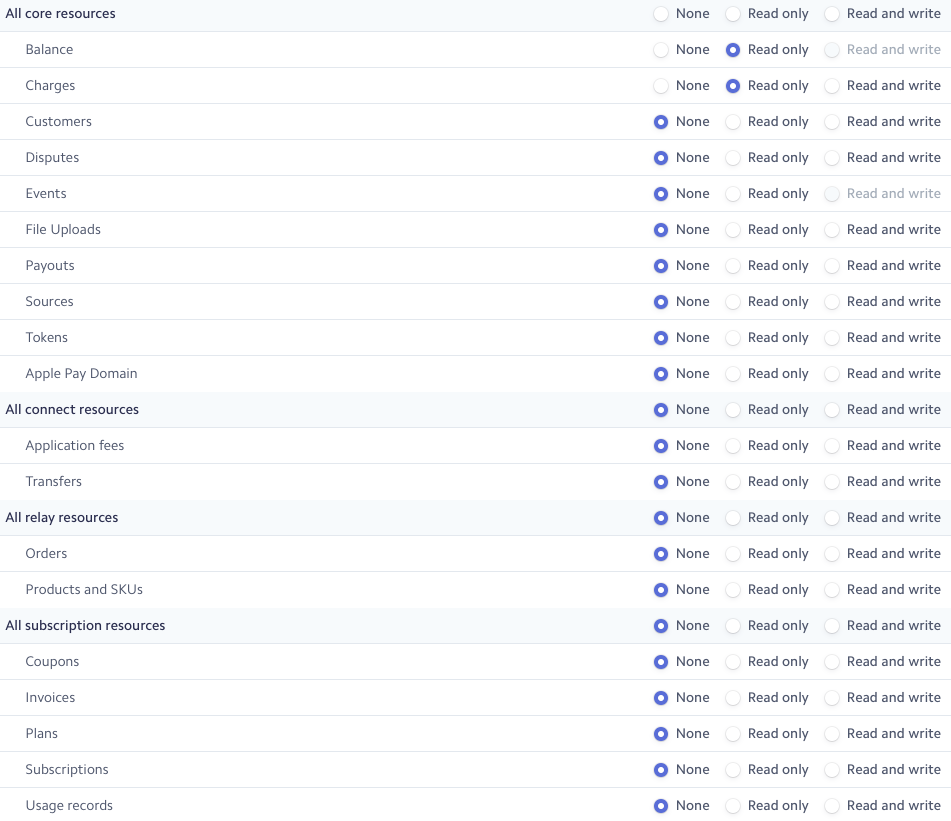

# index

## set up 
### a workspace

#### in eclipse
```
mvn org.apache.maven.plugins:maven-eclipse-plugin:2.8:eclipse && mvn eclipse:eclipse -DdownloadSources=true
```
### STRIPE API Key



### a release

Make sure you use SSH connection to github for auto-tag publishing!

```
mvn release:prepare
```
